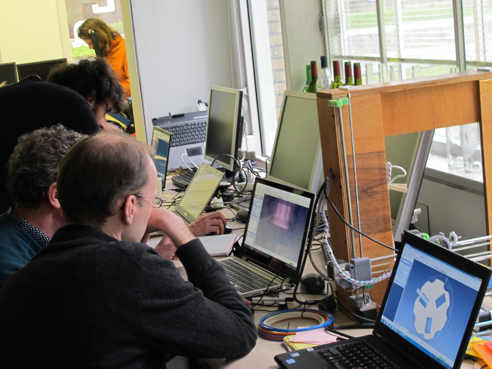

Alongside my work as a designer, I also engage in <b>academic research</b> and <b>teaching</b> across various contexts.

 
  <b>Research </b>  

In recent years, I have broadened my practice to encompass academic research. I am currently affiliated with the <a href="https://csc.dei.unipd.it/" target="_blank">Center for Computational Sonology</a>  at the University of Padova (Italy).

My research primarily revolves around the intersection of <b> design practices, human-computer interaction, and music technology</b>. I focus on exploring innovative ways to enhance how we interact with digital musical instruments and technology. A key aspect of my work involves fostering critical and sustainable reflections on these topics, aiming to push the boundaries of what is possible while considering their long-term impact on society and the environment.

In addition to theoretical exploration, <b>I actively engage in hands-on design case studies with individuals and communities</b>. This collaborative approach allows me to test and refine ideas in real-world contexts, ensuring that my research not only advances the field but also remains grounded in the needs and experiences of users and designers.

Below is a list of my contributions

 <b>Journal Publications</b>  

2024 - <b>Sustainable Internet of Musical Things: Strategies to Account for Environmental and Social Sustainability in Network-Based Interactive Music Systems</b> 
R Masu, N Merendino, A Rodà, L Turchet  
IEEE Access   DOI: <a href="https://doi.org/10.1109/ACCESS.2024.3393468" target="_blank">10.1109/ACCESS.2024.3393468</a> 

2024 -<b> Below 58 BPM", Involving real-time monitoring and self-medication practices in music performance through IoT technology</b> 
N Merendino, A Rodà, R Masu  
Frontiers in Computer Science   DOI: <a href="https://doi.org/10.3389/fcomp.2024.1187933" target="_blank">10.3389/fcomp.2024.1187933</a> 

2024 -<b> DIY Musical Instruments and Communities: From Handmade Electronic Circuits to Microcontrollers and Digital Fabrication</b> 
N Merendino  
Journal of Ubiquitous Music   <a href="https://periodicos.ufes.br/j-ubimus" target="_blank">Article</a> 

 <b>Conference Papers</b>  

2024 - <b>Prototyping a sustainable GUI for an IoMusT project: A reflection on the adoption of sustainable practices</b> 
ES Panozzo, M Bettega, A Rodà, N Merendino  
Proceedings of the International Conference on New Interfaces for Musical Expression   (In Publication) 

2024 -<b> Sustainable digital fabrication in NIME: Nine sustainability strategies for DMI production</b> 
N Merendino, M Bettega, A Pultz Melbye, J Sullivan, A Rodà, R Masu  
Proceedings of the International Conference on New Interfaces for Musical Expression 2024   (In Publication) 

2023 -<b> Poster-Noiseboard Project: Using Sensors and Long-Range Wireless Communication For Musical Augmentation of Skateboarding</b> 
N Merendino, G Dinello, A Rizzo, A Rodà, R Masu  
Proceedings of the 15th Biannual Conference of the Italian SIGCHI   DOI:  <a href="https://doi.org/10.1145/3605390.3610807" target="_blank">10.1145/3605390.3610807</a>  

2023 -<b> Redesigning the chowndolo: a reflection-on-action analysis to identify sustainable strategies for NIMEs design</b> 
N Merendino, L Giacomo, A Rodà, M Raul  
Proceedings of the International Conference on New Interfaces for Musical Expression 2024   DOI: <a href="https://doi.org/10.5281/zenodo.11189153 " target="_blank">10.5281/zenodo.11189153</a>   

2021 - <b>Defining an open source CAD workflow for experimental music and media arts</b> 
N Merendino, A Rodà 
Proceedings of the 10th International Conference on Digital and Interactive   DOI: <a href=" https://doi.org/10.1145/3483529.3483715" target="_blank">10.1145/3483529.3483715</a>   

2015 - <b>Not all days are equal: investigating the meaning in the digital calendar </b> 
D Buzzo, N Merendino  
Proceedings of the 33rd Annual ACM Conference Extended Abstracts on Human Factors in Computing Systems   DOI: <a href=" https://doi.org/10.1145/2702613.2732512" target="_blank">10.1145/2702613.2732512</a>   

 <b>Student Thesis supervision</b>  

2024 - <b>Towards Sustainable IoT: Theoretical Design of an Adaptive Environmental Monitoring Device Using LoRaWAN and GSM Connectivity</b>  
Student: Sandeep Kumar - Master Thesis  
(In Publication)

2024 - <b>Design and Prototype of a One-String MIDI Harp*</b>  
Student: Soffiati Corrado - Bachelor Thesis  
(In Publication)

2023 - <b>Below 58 BPM": Project and Development of a User Interface Following an Open Source Approach*</b>  
Student: Panozzo, Elisa Silene - Bachelor Thesis  
<a href=" https://thesis.unipd.it/handle/20.500.12608/52974" target="_blank">Link</a>   

2023 - <b>Definition of a Model for Self-Monitoring Stress Levels During a Musical Performance. A Case Study: The "Below 58 BPM" Project*</b>  
Student: Maddalena Tommaso - Master Thesis  
<a href=" https://thesis.unipd.it/handle/20.500.12608/60405" target="_blank">Link</a>   

2023 - <b>Plants, Computer Music, and IoT: A Study on the Integration Between Plants and Musical Performance* </b> 
Student: Sterlino, Massimo - Bachelor Thesis  
<a href=" https://thesis.unipd.it/handle/20.500.12608/57110" target="_blank">Link</a>   

*As the university allows the theses to be in Italian, the titles have been translated. Please refer to the links to view the content in its original language.
 

 <b>Lectures and Lessons</b>  

2024 - <b>The Hong Kong University of Science and Technology</b> (Guangzhou), China 
Computational Media and Arts (CMA)  
Classes on design practices and digital fabrication for tangible interfaces development 

2023 -<b>Università degli studi di Padova</b>, Italy  
COMPUTER ENGINEERING FOR MUSIC AND MULTIMEDIA COURSE 
Class on Networked Musical Interfaces

2023 -<b> Institute of Music, Science and Engineering King Mongkut's Institute of Technology</b> Ladkrabang, Bangkok, Thailand 
Lecture on Musical instruments Design and Development 

2023 -<b>Università degli studi di Parma</b>, Italy  
DESIGN SOSTENIBILE PER IL SISTEMA ALIMENTARE COURSE 
Lecture on Musical instruments Design and Development

2022 - <b>Conservatorio C. Pollini</b>, Padova, Italy 
SaMPL School "Web audio and IoT for la musical production"  
Master Class on Networked Musical Interfaces

2021 -<b>Università degli studi di Padova</b>, Italy  
COMPUTER ENGINEERING FOR MUSIC AND MULTIMEDIA COURSE 
Class on Printed Circuit Board design 

 <b>Other Research Activities</b>  

2024 - Presentation at IEEE 5th International Symposium on the Internet of sounds 

2024 - Presentation at NIME 2023 Conference 

2023 - Workshop Hosting at NIME Eco wiki and digital fabrication Workshop  

2023 - resentation at NIME 2023 Conference  

2023 - Poster Presentation at 15th Biannual Conference of the Italian SIGCHI  

2021 - Presentation at the  10th International Conference on Digital and Interactive Art  

 
  <b>Teaching </b>  

In addition to my work teaching at universities, I have been organizing courses and workshops for nearly a decade in FabLabs, maker spaces, and various other institutions. These sessions primarily focus on introducing and working with FLOSS (Free/Libre and Open Source Software) CAD tools, helping participants gain valuable skills in open-source design and digital fabrication.

Over the past several years, I have taught classes in a variety of settings as both a freelance professional and a FabLab/Makerspac Manager. Some of the key institutions where I’ve organised and led workshops include:

ZB45 (Amsterdam, NL)  
FablabWag (Wageningen, NL)  
FablabGroningen (Groningen, NL)  
STEIM (Amsterdam, NL) 
Roma Makers (Rome, Italy) 
Waag Society (Amsterdam, NL) 
Fab13 (Tilburg, NL) 
CrunchLab (Venice, Italy) 
Fablab Parma (Italy) 
SoundMit (Turin, Italy) 
Instrument Inventors Initiative (Den Haag, NL)

In addition to in-person teaching, I have created several  <a href="https://vimeo.com/album/4661933" target="_blank">video tutorials </a>  to promote and expand the use of FLOSS (Free/Libre and Open Source Software) in creative and technical fields.

<iframe src="https://player.vimeo.com/video/360649306" width="640" height="360" frameborder="0" allow="autoplay; fullscreen" allowfullscreen></iframe>

My teaching activities have been supported by various grants, including funding from <a href="https://stimuleringsfonds.nl/en/" target="_blank"> The Creative Industries Fund of the Netherlands </a>  and <a href="https://stimuleringsfonds.nl/en/" target="_blank"> Google’s Digital News Innovation Fund. </a> 

   

   

