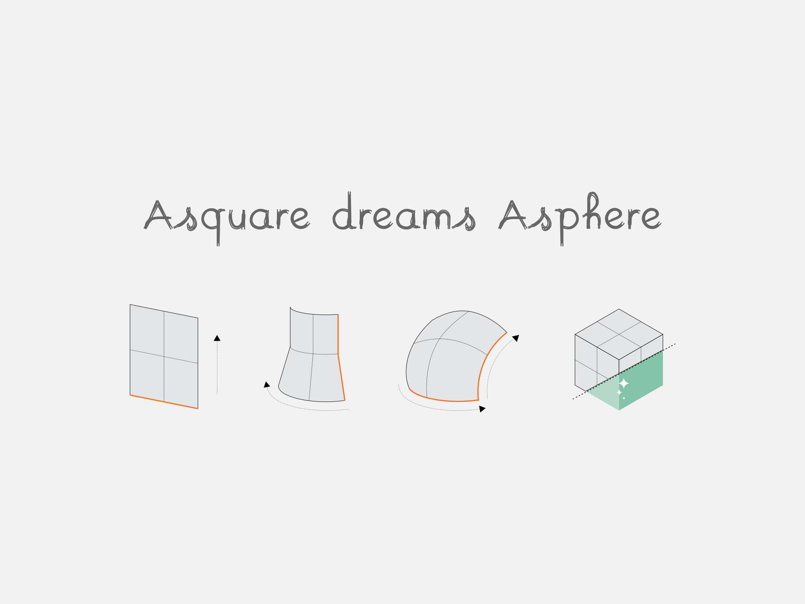

In parallel with my main activity of designer, and as an open-source software activist I also like to give workshops around. I named this parallel activity <b>“A square dreams A sphere”</b>, check below for more informations.

 <b> A square derams A sphere </b> 

“A square dreams A sphere” is an initiative that takes name from the book “Flatland” by Edwin Abbott.; the story of “A square” that tries to convince his bi-dimensional society about the existence of a third dimension.
It is a didactic extension of my ordinary work.

Similar to the society described in the book, most of the creative industry does not see any
proper alternative to the commercial softwares available. My initiative has the goal of breaking this concept
through the act of explaining and/or teaching that there's an alternative.

As a final result of this activity I would like to "plant a seed" for a fervent community of people who use
open-source software to develop their Designs.

 <b> Tools – open-source CAD and digital fabrication softwares</b> 

During the workshop/lectures we will use/explore the open source and cross platform softwares .
In this way, participants will be able to explore on their own after workshops/lectures promoting open source culture and concretely helping the single individuals who attend one of the events of the initiative.

 <b> Workshops</b> 

<a href="https://stimuleringsfonds.nl/en/" target="_blank">The Creative Industries Fund of the Netherlands </a>  funded in 2016 a first round of workshops

The workshops took place in the following places:  
ZB45 (Amsterdam) 
FablabWag (Wageningen) 
FablabGroningen (Groningen) 
STEIM (Amsterdam) 
Roma Makers (Rome, Italy) 
Waag Society (Amsterdam) 
Fab13 (Tilburg) 

The final workshop consisted in a full-fledged Design session where the participants designed the <a href="wonkydrumseq.html" target="_blank"> Wonky Drum Sequencer </a>  (specifically designed for the initiative), using FreeCAD, KiCAD and Inkscape.

All the materials regarding the wonky drum sequencer can be found <a href="https://github.com/chihauccisoilconte/a-square-dreams-a-sphere/tree/master/wonky_drum_seq-materials" target="_blank">here </a> 

 <b> Video Tutorials</b> 

 As a further output of the project there's a small class made out of 6 video tutorial tha can be found <a href="https://vimeo.com/album/4661933" target="_blank">here </a>  

<iframe src="https://player.vimeo.com/video/203838397" width="640" height="360" frameborder="0" allowfullscreen></iframe>

   

