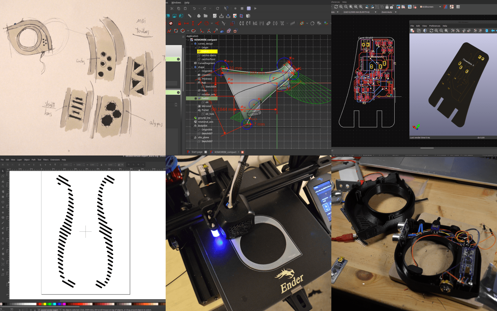
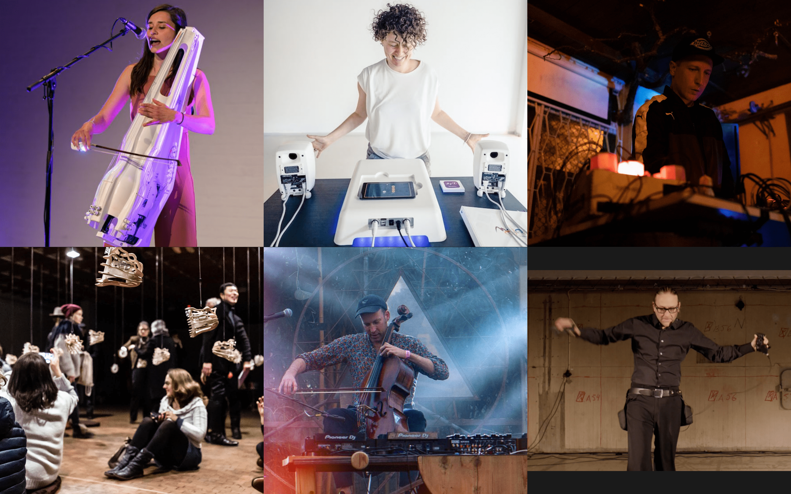
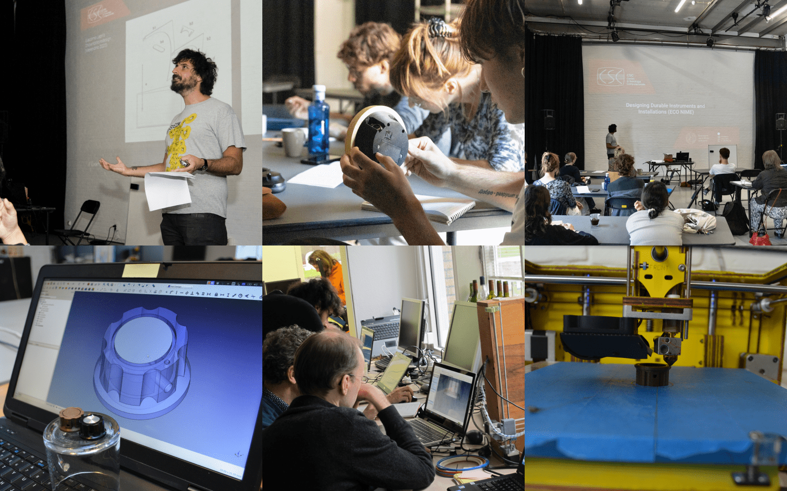

 <b>Chi ha ucciso Il Conte? </b>
("who killed the Count?")

 
  <b>Design </b>  

My name is Nicolò Merendino andI work as a UX/UI designer under the pseudonym "Chi ha Ucciso il Conte?" My work primarily focuses on <b>creating interfaces for electronic music and multimedia arts </b>, collaborating with artists to design and build custom instruments that support their creative practices.  I specialize in both <b>designing and constructing</b> electronic devices as well as developing graphical user interfaces tailored to specific needs.
I am specialized in the use of <b>Free/Libre Open Source Software</b>
  
With a strong background in <b>digital fabrication</b>, I operate my own fabrication lab and have previously served as a lab manager in FabLabs, overseeing a range of projects. 
  
You can find a selection of the projects I developed in my <a href="https://chihauccisoilconte.eu/1design.html" target="_blank"> Design</a> page 

Throughout my career, I’ve collaborated with artists, foundations, and companies, contributing to a variety of creative and technical endeavors. I also have extensive experience in <b>writing applications for funding</b>, successfully securing resources for multiple projects both independently and as part of a team.

 
  <b>Outreach </b>  

In the hands of the artists I worked with, my work has been featured in <b>over 500 performances and installations</b> at prestigious venues and
festivals, including the <b>CTM Festival</b> (Germany), <b>KIKK Festival</b> (Belgium), <b>the National Museum of
Modern Art in Kyoto</b> (Japan), and the <b>Bauhaus 100 Festival</b>. It has been showcased in 185 cities
worldwide. 

you can see a specific list of events in my <a href="https://chihauccisoilconte.eu/3outreach.html" target="_blank"> outreach</a> page.  

  <b>Research </b>  

In recent years, I’ve expanded my work into <b>academic research</b>, applying my design and fabrication skills to explore new areas of inquiry, you can find more details in the <a href="https://chihauccisoilconte.eu/2research.html" target="_blank"> dedicated page</a> . 

I am currently affiliated with the <a href="https://csc.dei.unipd.it/" target="_blank">Center for Computational Sonology</a>  at the University of Padova (Italy).

My recent research effort has primarily explored <b>critical reflection and sustainable action within design practices</b>. I have investigated open-source tools and methods to develop interfaces in both the form of tangible devices and GUIs . The aim of these explorations is to push the boundaries of current practices, finding solutions to enhance the full potential of each design project, while <b>considering its long-term impact</b>.

 
  <b>Teaching </b>  

In addition to my work as a designer and my university teaching as part of my research, I have been organizing courses and workshops for nearly a decade in FabLabs, makerspaces, and various other institutions. These sessions primarily focus on introducing and working with FLOSS (Free/Libre and Open Source Software) CAD tools, helping participants develop valuable skills in open-source design and digital fabrication.

Over the past several years, I have taught classes in various settings, both as a freelance professional and as a FabLab/Makerspace Manager. Some of the key institutions where I have organized and led workshops include ZB45 (Amsterdam, NL), the Instrument Inventors Initiative (The Hague, NL), SoundMit (Turin, Italy), and Waag Society (Amsterdam, NL), among others.  

Years of freelance work and academia in Italy turned me into an evil super villain, named <a href="https://chihauccisoilconte.eu/7barondeathwavebarberini.html" target="_blank">Baron Deathwave Barberini</a> . 

   

