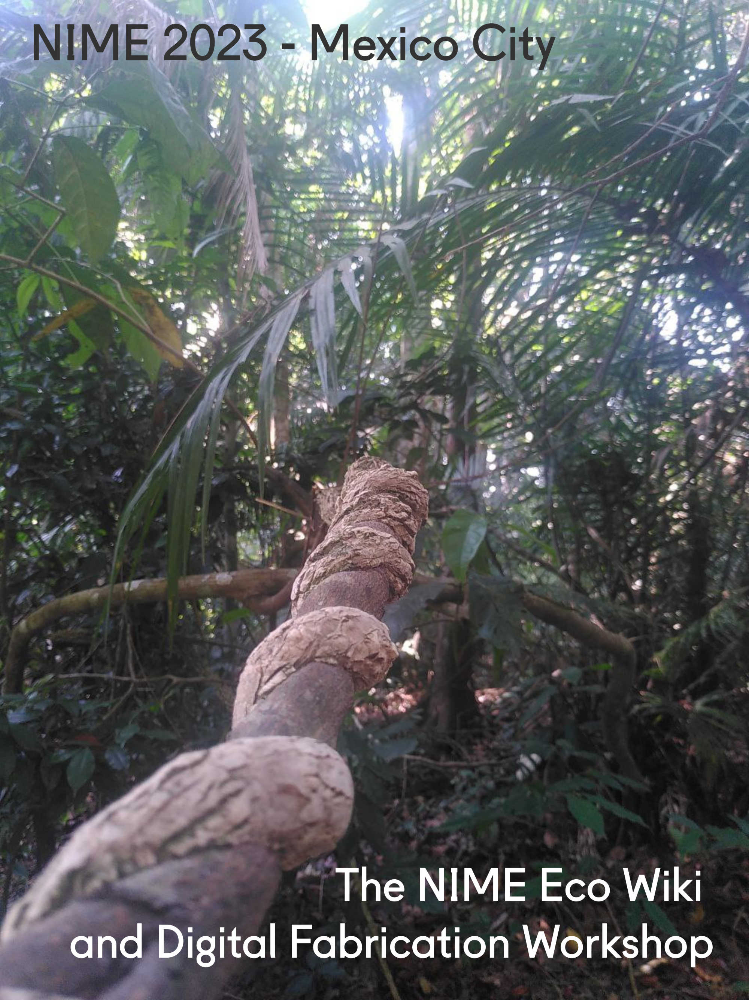

 <b>The NIME Eco Wiki and Digital Fabrication </b>

Sustainability and longevity of technologies are compelling elements today and are becoming increasingly debated within NIME. The NIME eco wiki which the proposer of this workshop launched a few years ago is intended as a repository of resources to facilitate a more environmentally aware NIME practice. Digital fabrication is without any doubt a central component of NIME research and as such deserves special attention. 

With the increased availability and low-cost of microprocessors and sensors, embedded technologies have become ubiquitous. Yet these technologies often contain materials that are mined under environmentally and socially unsustainable circumstances and additionally are difficult to recycle.

For this reason, in this workshop the three initiators of the NIME eco wiki together with an expert in digital fabrication (Nicolò Merendino, aka <a href="https://chihauccisoilconte.eu/" target="_blank"> "Chi ha Uccicso Il Conte?" </a> ) will specifically look at hardware components from an environmental perspective. 
We are preparing a set of new pages on digital fabrication, and longevity, touching on a number of aspects of sustainability, with a particular focus on reducing obsolescence. During this workshop, we will present these new pages and collect feedback to refine the pages and the information in order to be as useful as possible for our community. Bring your experience!

The workshop will last approximately 2 hours and half and will be hybrid. It is organized by Nicolò Merendino, Johnny Sulliva, Adam Melbye, and Raul Masu.

The workshop will last approximately 2 hours and half and will be hybrid. It is organized by Nicolò Merendino, Johnny Sulliva, Adam Melbye, and Raul Masu.

Further info on the NIME Eco Wiki Project can be found <a href="https://docs.google.com/forms/d/e/1FAIpQLSdR1TShWqvyrDkm3hA7FdsTwf3DHtdGRCHJVPGEQ-gXaQ9y4A/viewform?usp=send_form" target="_blank">here </a>  

Registration link <a href="https://eco.nime.org/ " target="_blank">here </a>  

   

