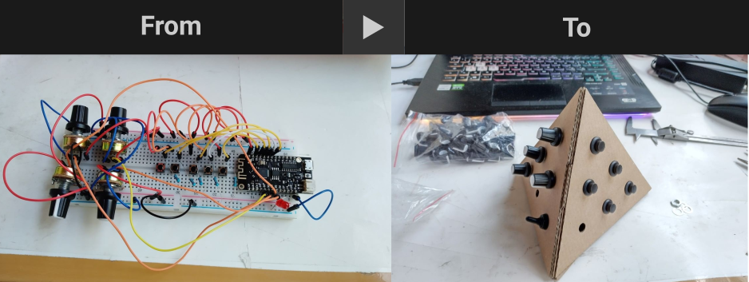

As part of my research period at <a href= "https://instrumentinventors.org/" target= "_blank"> Instruments Inventors Initiative </a>, I'll give some <b>(free)</b> classes on open-source CAD software that can be used to design tangible user interfaces and, more broadly, electronic devices, to fight obsolescence of projects and avoid dependency from big software companies as means to develop more sustainable projects.

The software taught will be <a href="https://www.kicad.org/" target="_blank"> KiCAD </a>, <a href="https://www.freecad.org/" target="_blank"> FreeCAD </a> and <a href="https://inkscape.org/" target="_blank"> Inkscape </a>. those softwares will allow the participants to design circuits, 3d casings, and virtually any other aspect that can emerge while designing a piece of hardware.
To summarize, <b> we will learn how to bring a project from being a breadboard wrapped with tape to a stable and usable prototype, using exclusively Open Source software </b>

For each one of those applications, I'll give a 1-day workshop divided into two parts: a step-by-step tutorial where we will reproduce the Design of an IoT controller and a second, more collaborative part where we will look at projects and ideas and see how somebody can uns the software to develop them. Last, we will see how somebody can apply the software in digital fabrication (including the machines in the iii's lab!)

The events will take place at iii on the 21st of September (KiCAD), on the 22nd of September (FreeCAD), and on the 23rd of September (Inkscape), from 10.00 to 17.00 in Willem Dreespark 312 2531 XS, The Hague (NL) here is a more detailed description of the workshops: 

<b> KiCAD (21/09/2023) - </b> In this workshop, we will learn the basis of KiCAD, a software aimed at designing electronic schematics and circuits. In the workshop, we will explore all the necessary features to make our own Printed Circuit Board (PCB). At the end of the workshop, the participants will be able to produce their own PCB as well as knocking a producer's door to commission the making of a bunch of circuits - specific digital fabrication tips will be given as well 

<b> FreeCAD (22/09/2023) - </b> In this workshop, we will learn the basis of FreeCAD, a 3D modeling software aimed at designing 3D models of physical projects such as casings, sculptures, and much more. In the workshop, we will explore all the necessary features to model our own object. At the end of the workshop, the participants will be able to 3D print their own object as well as knocking a producer's door to commission the making of a bunch of products with injection molding and other fabrication technologies - specific digital fabrication tips will be given as well 

<b> Inkscape (23/09/2023) - </b> In this workshop, we will learn the basis of Inkscape, a 2D vector graphic software aimed to design bidimensional figures to be laser-cut, CNC milled, printed on paper, and much more. In the workshop, we will explore all the features that are necessary to draw images of many kinds - specific digital fabrication tips will be given as well 

<b> Mentoring Program - </b>In the weeks after the classes, the instructor will tutor a few participants (up to 3 projects in total) in designing their projects through a series of video calls to be planned with the participants. 

<b> Registration Form - </b>In order to take part in the classes, you'll have to fill <a href=" https://forms.gle/Uysp4qmTifyn1GpTA" target= "_blank">this form </a> . attendance to the classes is free of charge, there will be a maximum of 10 participants, and the participants will have to bring <b> a laptop with the software installed and a mouse (that's quite important)</b> 

<b> The Instructor  - </b> "Chi Ha Ucciso il Conte?" is a pseudonym for the Parma (Italy) based UX/UI designer Nicolò Merendino. It is not a random fact that "Chi Ha Ucciso Il Conte?" is a question, not a statement. My approach to Design starts from the idea that Design is a process that requires people to ask themselves many questions.
"Chi Ha Ucciso il Conte?" is specialized in developing the Design of electronic music instruments and components for media art installations. His work involves understanding and translating the artist's needs into usable and expressive shapes. Nick is skilled in using Digital Fabrication techniques; starting from an internship at STEIM in the Netherlands, he already collaborated with the development of many electronic music instruments and sound installations all over Europe and beyond.

If you have any questions, do not hesitate and contact me via email (chihauccisoilconte@gmail.com) 

The proposed activities are part of the research project, "The Sustainable IoT, A Study about a green approach in IoT systems development and Its Impact on human-computer Interaction", and as part of the <a href=" https://eco.nime.org/" target= "_blank">ECO NIME wiki project </a>  conducted by  <a href=" csc.dei.unipd.it" target="_blank">CSC (University of Padova) </a>. The data collected during the classes will be used in the study, and the participants will have to sign an informed consent declaration.

The proposed activities are part of the research project, "The Sustainable IoT, A Study about a green approach in IoT systems development and Its impact on human-computer Interaction", and as part of the <a href=" https://eco.nime.org/" target= "_blank">ECO NIME wiki project </a>  conducted by  <a href=" csc.dei.unipd.it" target="_blank">CSC (University of Padova) </a>. The data collected during the classes will be used in the study, and the participants will have to sign an informed consent declaration 

   

