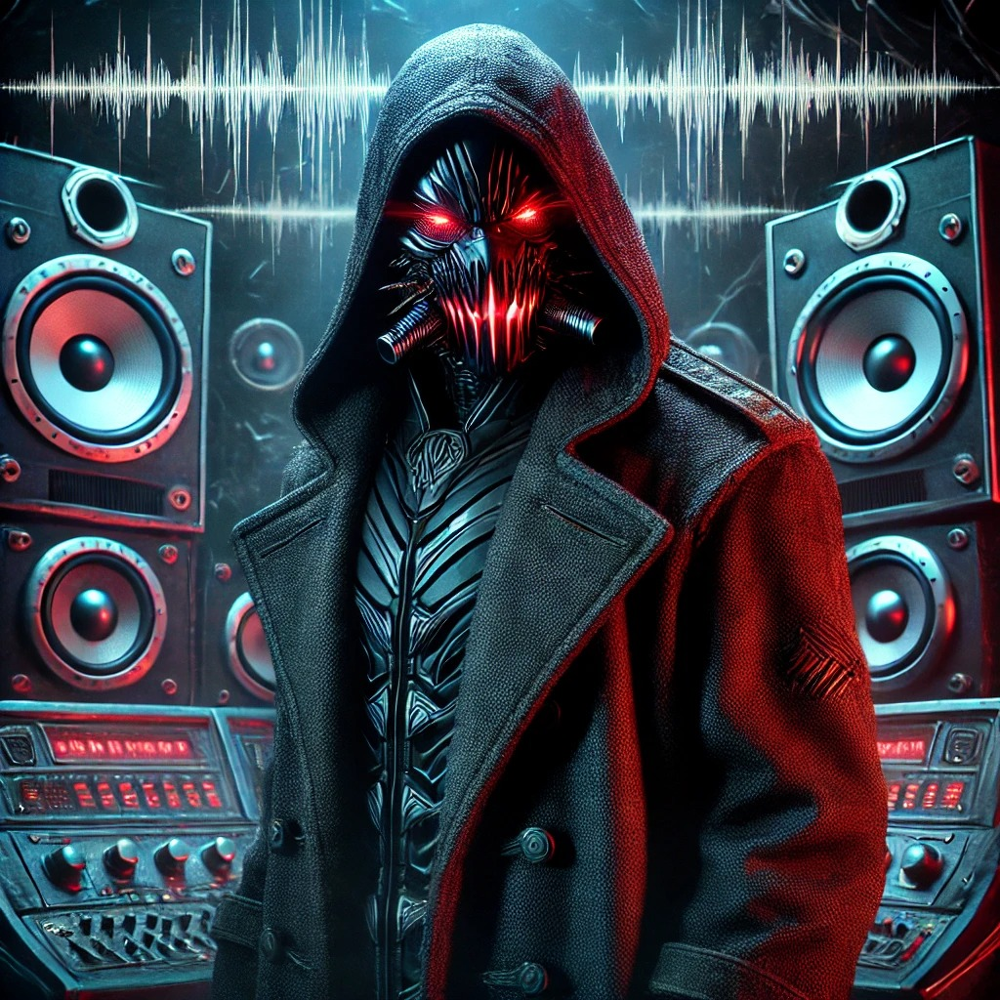
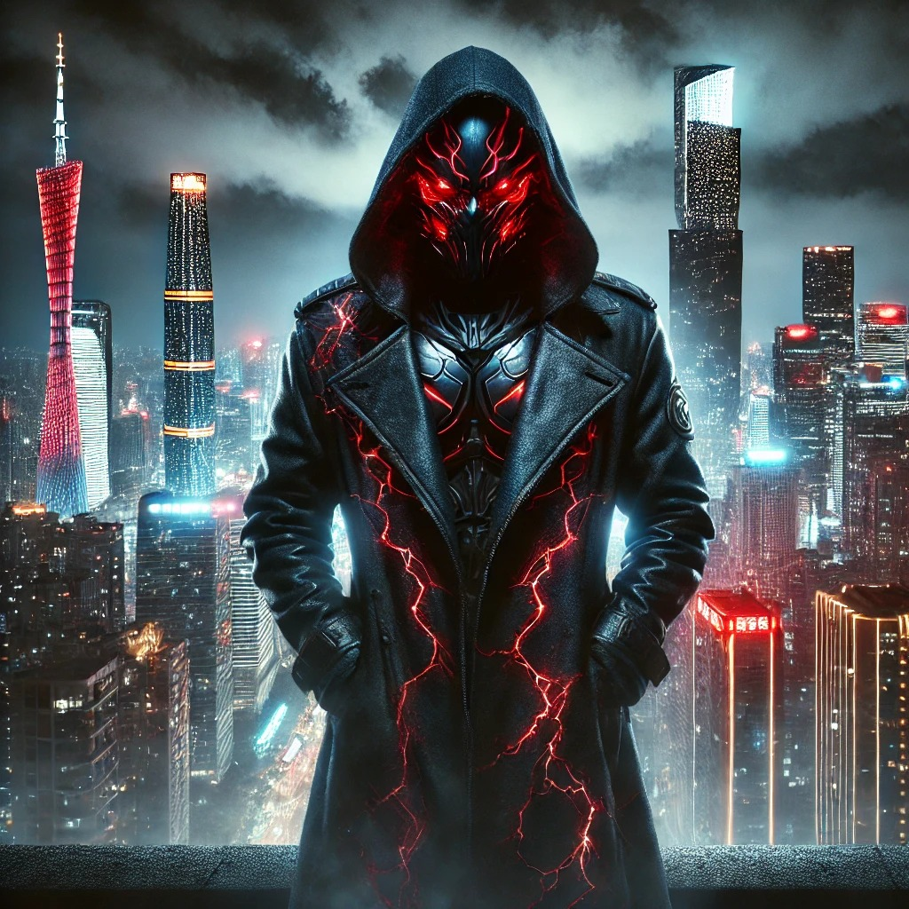

Years of freelance work and academia in Italy turned me into an evil super villain, below you will find the origins of Baron Deathsong Barberini 

Nicolò Merendino was born under the weight of a name heavy with history. A scion of an ancient Roman family whose roots curled deep into the soil of the Empire’s forgotten rites and forbidden knowledge, Nicolò grew up surrounded not by riches, but by relics — faded crests, crumbling manuscripts, and the cold pride of a lineage that once ruled but had long since faded from power. 

Though his family’s coffers had thinned, their blood still carried strange currents. Whispers spoke of the Merendinos' ancient pacts — guardians of esoteric rites, manipulators of resonance and frequency in ways the modern world no longer understood. Nicolò, brilliant and intense, inherited not gold but this darker legacy.

Determined to carve his own path, Nicolò studied Interaction Design, mastering the fusion of art and technology. His mind was a crucible where Rome's ancient sonic mysteries met cutting-edge engineering. He graduated with honors, his work dazzling peers and professors alike. Yet, beneath his success, envy gnawed — a cold, persistent ember. His colleagues, floating on inherited privilege, seemed untouched by struggle, while he bore the invisible weight of legacy and expectation.

In Amsterdam, Nicolò’s genius flourished. He designed breathtaking interactive musical instruments, where sound became touch, and gesture conjured symphonies. The city’s vibrant art-tech scene fed his natural inclinations, and for a time, he touched something close to greatness. His creations shimmered at the boundary of art and ritual, technical skill and ancient intuition.

But duty called him back to Italy — Personal matters forced him to move to Venice. There, his visions faltered. Italy's decaying cultural institutions stifled innovation, and despite his brilliance, Nicolò found his projects dismissed, his path obstructed by bureaucracy and mediocrity. Freelancing kept his body afloat, but his spirit began to fracture. The vast gulf between his skill and the recognition he craved became unbearable.

His rage deepened. And with it, the old blood stirred.

Turning inward, Nicolò embraced the ancestral knowledge buried in his family’s grimoires — the forgotten science of resonance as power, sound as weapon, and vibration as force. He poured himself into academia, not merely to study but to weaponize his knowledge. His PhD on Digital Musical Instruments became a crucible, blending modern research with the dangerous frequencies once used in secret Roman rites.

But when the final blow fell — his research funding cut, his future obliterated — something inside Nicolò broke.

For weeks, he vanished into his lab, a place that became both tomb and forge. When he emerged, he was no longer Nicolò Merendino. He was Baron Deathwave Barberini — the name a stolen mantle from Rome’s old elite, worn like a mockery of the society that spurned him. Clad in a metal mask inscribed with ancient sigils and a suit powered by sonic energy, he had transformed his beautiful instruments into terrible weapons.

His armor throbbed with infrasound pulses that could shatter bones and minds. His devices could summon resonance fields that warped reality, echoes of his family's ancient rites. The esoteric powers of his bloodline now surged through the amplifiers and transducers he crafted — old magic reborn through new machines.

Now, Baron Deathwave Barberini wages war on the world that betrayed him. Superheroes — those blessed with natural-born powers — became his targets, symbols of unearned privilege. With every battle, he unleashes devastating sonic waves. But even at his most deadly, his tragic flaw remains: his pride. Time and again, victory slips away as he pauses mid-fight to lecture on the technical and philosophical aspects of his weapons — musings on resonance, power, and the collapse of meaning in modern sound.

His enemies recover, they strike back, and the Baron falls — again and again.

He is the villain of his age: a dark maestro of ancient forces and modern rage, born of noble blood and corrupted genius. In a world where capitalism crowns the shallow and leaves true talent to rot, where inherited powers triumph over earned mastery, who is the real villain?
The masked Baron who makes the world tremble, or the world that made him?

   

   

