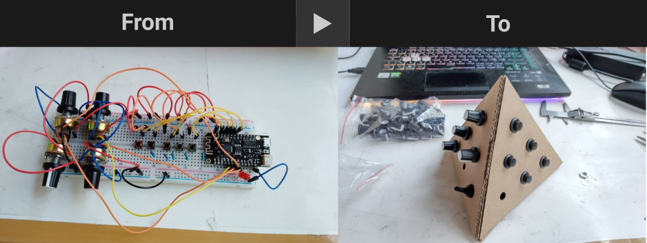

Disclaimer - this webpage is currently a mock-up for internal use, accurate details about the initiative will be shared in due time.The details mentioned above may change depending on the needs and availability of the organizations and participants involved 
 

<b>DocAlive Workshop: Reflecting on Documentation, Archiving and Re-activation Practices in Multimedia Arts</b>
 

This workshop, hosted at The Hong Kong University of Science and Technology (Guangzhou), brings together scholars, designers, and creative practitioners to explore how documentation practices shape the development, circulation, and impact of multimedia design projects. As creative outputs increasingly integrate interactive media, computational systems, and cross-disciplinary methods, the act of documenting work has become essential—not only for archiving processes and outcomes, but also for enabling critical reflection, collaboration, and future research.  

<b>Venue - </b> HKUST, MCA Lab and Online  

<b>roundup</b>  
09:30–10:00 — Registration and Opening Remarks   

10:00–11:00 — Keynote Lecture: Documentation as Creative Practice   

11:00–12:30 — Panel Discussion: Approaches to Recording Multimedia Processes   

12:30–14:00 — Lunch Break   

14:00–15:30 — Workshop Session: Tools and Frameworks for Effective Documentation   

15:30–16:00 — Break   

16:00–17:00 — Case Studies from Practitioners 17:00–17:30 — Closing Roundtable and Q&A  

<b>Speakers</b>  
The speakers we plan to invite include experienced multimedia artists, researchers, and practitioners whose work spans interaction design, audiovisual performance, computational arts, and archival studies. Their contributions will highlight diverse strategies for capturing creative processes, from technical documentation to narrative-driven formats. Besides the invited speakers and the faculty involved, the workshop will also include an open call through which interested scholars and practitioners can apply to take part in the activities.

<b>Faculty Involved</b>   

 

Nicolò Merendino, Assistant professor of practice, HKUST(GZ)   

Vennes CHENG Sau Wai, Lecturer I, HKUST   

 

<b>Participants Involved</b>   

 

Marije Baalman (NL), III Foundation - Computational Media & Arts practitioner   

Prof. Felipe Calegario (BR), Centro de Informática Universidade Federal de Pernambuco   

Prof. Raul Masu (IT), Conservatorio di Trento   

Karen Wu (HK), Artistic Director of Contemporary Musiking Hong Kong (CMHK)   

Prof. Thor Magnusson (IS), Director of Intelligent Instruments Lab - Research Professor School of Humanities Institute of Philosophy, University of Icelang  

   

