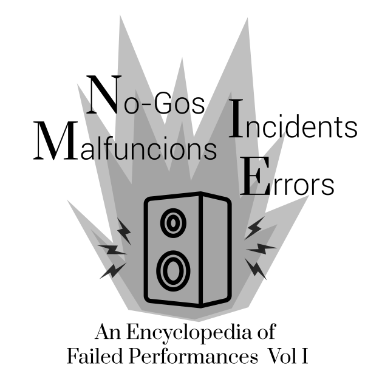

<b>Have you ever experienced a situation where your performance did not go according to plan?</b> 
Perhaps, the instrument you built broke or caught fire on stage, the soundperson hated you, or you were just too nervous to perform well...

If the answer to the question above is “yes”, “maybe” or “it surely felt that way” then you might be interested in contributing to our initiative.

We are an international group of artists/researchers in the field of multimedia arts, experimental music and instrument building based in the Hong Kong University of Science and Technology (GZ).

We are working on a project that focuses on <b>Failed Performances with idiosyncratic setups </b> (self-built instruments, new interfaces, or any other bespoke musical systems and contraptions) with the working title <b> No-gos Interruptions Malfunctions and Errors</b>.

To this end, <b>we are collecting stories and anecdotes from the community regarding instruments and performances that failed, broke, remained silent or misbehaved on stage</b>.

We do not attempt to give a universal definition of what “failure” in experimental performance context exactly is, rather, we are interested in the performers’ subjective perspectives. We prioritize the human experience, but we are not excluding other factors such as organizational or technical failures, non-human agency or supernatural phenomena.

If you are interested in participating in such initiative, please send us:
 
- A written account of a performance that you consider as a failure (we recommend 300 to 800 words) 
- The level of details and stylistic choices are at author’s discretion 
- One word that, in your opinion, captures the essence of the story 
- Optional: Photo\video documentation of the story

Here is an example of what a story could be:

This story is about a performance I did with my former instrument named the "despophone". I built the instrument as a critique of the contemporary demand for seamless responsiveness in musical interfaces.

At the time, I was dissatisfied with interfaces that responded too reliably. Buttons were too obedient, sensors too eager. I wanted an instrument that could doubt me, something that would occasionally say no or at least not yet. The result was a table-sized assemblage of salvaged circuit boards, piezo discs glued with epoxy that never fully cured, a small fan motor, and a custom patch that translated unstable voltage into brittle, percussive sound. I called it a “semi-autonomous listening device,” which was generous. In reality, it was an argument held together with tape.

The performance took place in a small black box venue. The soundcheck was rushed; the soundperson looked tired and mildly hostile, as if experimental musicians were an occupational hazard. When I explained that the instrument needed to be “left alone for a moment before it would speak,” they nodded without listening and asked if it had XLR.

On stage, under lights that were warmer than my workshop, the instrument began to behave differently. The fan motor—meant to gently agitate a contact mic—started spinning faster than expected. The piezos fed back into one another. The system produced a low electrical whine I had never heard before. It wasn’t loud, but it was invasive, like tinnitus projected outward.

I tried to slow it down. The knobs felt suddenly symbolic rather than functional. Each adjustment seemed to provoke the opposite response. The patch froze, unfroze, then froze again. The instrument emitted a single sharp click, like punctuation, and then went silent.

At first, I thought this was a minor glitch—something the audience might read as intentional restraint. I waited. Silence stretched. I became acutely aware of my breathing, the audience’s shifting weight, the soundperson’s hand hovering near the mute button. I tapped the table lightly. Nothing. I lifted one of the piezos; the epoxy gave way and the disc fell, dangling by its wire like a loose tooth.

Then the smell arrived.

It was faint but unmistakable: overheated plastic, something electrical crossing a line. A thin thread of smoke rose from the power distribution board. Not dramatic enough to justify panic, but sufficient to reframe the silence. I remember thinking, with a strange calm, so this is the instrument deciding to exit.

I unplugged everything. The smoke stopped. The silence remained, now heavier, less ambiguous. I looked up at the audience for the first time. Some were smiling politely. One person was clearly enjoying this more than sound. I felt an urge to explain, to narrate the failure, to translate it back into meaning. I resisted.

Instead, I stood there for the remaining time slot, hands off the table, listening to the room. HVAC hum. A chair creak. Someone coughing. The instrument, inert, finally perfectly quiet. In a way, it had achieved what I asked of it: refusal, hesitation taken to its logical extreme.

Afterwards, several people told me they found the performance “brave.” One asked if the smoke was part of the composition. The soundperson avoided eye contact. Back home, I discovered that a voltage regulator had burned out, likely due to a feedback loop I had underestimated. A simple failure, technically speaking.

I never repaired the instrument. Not out of respect, exactly, but because it felt complete. It had performed its last and most decisive gesture. It taught me that failure is not always collapse; sometimes it is clarity. The moment when an object stops negotiating and states, unequivocally, this is as far as I go.

Send the materials mentioned above to
<a href="mailto:noinmaer@proton.me">noinmaer@proton.me</a>
This project operates as a long-term initiative; we continuously accept submissions.

The final project will take the form of a <b>printed zine</b> (and a pdf document) with submissions arranged alphabetically from A-to-Z, according to the keyword that the authors provided. We reserve the right to use a synonym to the word of your choosing for indexing purposes, e.g. disaster [also catastrophe]. The authors' identities will be anonymous by default, unless authors explicitly request to show their name or an alias. The stories will be presented verbatim; cases where edits are needed will be indicated in the text.

The zine will be distributed free of charge through venues and organizations interested. This is a non-profit project. 

We look forward to reading your tragic stories 

No-gos, Incidents, Malfunctions and Errors is a project by 
<a href="https://alakouzmin.github.io/">Yuri Kuzmin</a>
 , 陈心然 (Xinran Chen), <a href="https://www.linkedin.com/in/wenqing-gu-a562b9223?utm_source=share&utm_campaign=share_via&utm_content=profile&utm_medium=ios_app">顾文清 (Gu Wenqing)</a> and <a href="https://chihauccisoilconte.eu">Nicolo' Merendino (aka Chi ha Ucciso Il Conte?)</a>  

 
